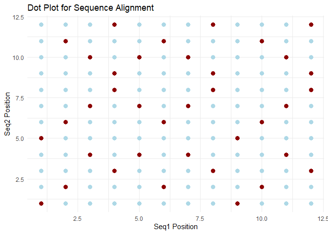

# **Introduction**
*Genomic analysis made elegant using R*

## **Overview**

BioSeqAligner is a R package designed for DNA sequence analysis. Whether you're a bioinformatician, 
researcher, or student, this package provides intuitive functions 
for for motif detection, sequence alignment
visualization, reverse complement calculation, DNA-to-RNA transcription,
and GC content calculation. It simplifies essential function for manipulating and analyzing DNA sequences.

## **Key Features**

-   🔍 Motif Finder: Identify all occurrences of a motif in a DNA sequence.
-   🧬 Reverse Complement: Generate the reverse complement of a sequence.
-   🧪 DNA to RNA Transcription: Convert DNA sequences to RNA by replacing thymine (T) with uracil (U).
-   📊 GC Content Calculator: Calculate the percentage of guanine (G) and cytosine (C) in your DNA sequence using S3 objects.
-   📈 Dot Plot Visualization: Create dot plots to visualize sequence alignments.

## **Installation**

#### **For Github**

You can install this package directly from github

-   devtools::install_github(“Code-krafter22/BioSeqAligner”)

-   library(BioSeqAligner)

## **Packages required**

-   install.packages(“ggplot2”)

-   install.packages(“stringi”)

-   install.packages(“stringr”)

## **Load required libraries**

-   library(ggplot2)

-   library(stringi)

-   library(stringr)

## **Using BioSeqAligner**

### 1. **find_motif() **:

This function identifies all starting positions of a specified motif
within a DNA sequence. It performs a linear scan and returns the
positions where the motif matches the sequence.

#### **Example**

-   find_motif(“GATCGATCGTAT”, “GAT”)

-   ***Returns [1] 1 5***

### 2. **generate_dot_plot()**:

This function creates a dot plot to visualize the alignment between two
DNA sequences.

#### **Library required**

-   *library(ggplot2)*

#### **Example**

-   generate_dot_plot(“GATCGATCGTAT”, “GATATCGTCATC”)

***Returns a graph plot for sequence alignment where X-axis
contains the Sequence 1 and Y-axis contains Sequence 2. The dark red dot
signifies the similarities in the sequence and the blue dot signifies
the dissimilarities in the sequence.***

### **Dot plot**

-  Overview of how the plot looks

### 3. **reverse_complement()**:

This function computes the reverse complement of a given DNA sequence by
reversing it and substituting complementary bases.

#### **Library required**

-   *library(stringi)*

#### **Example**

-   reverse_complement(“GATCGATCGTAT”)

-   ***Returns [1] “ATACGATCGATC”***

### 4. **transcribe\_dna()**:

This function converts a DNA sequence into an RNA sequence by replacing
thymine (T) with uracil (U).

#### **Library required**

-   *library(stringi)*

#### **Example**

-    transcribe_dna(“GATCGATCGTAT”)

-    ***Returns [1] “GAUCGAUCGUAU”***

### 5. **gc_content()**:

Constructs an S3 object representing a DNA sequence with validation to
ensure it contains only valid DNA bases (A, C, G, T). Calculates the GC
content (percentage of guanine and cytosine) in a DNA sequence
represented by a DNASequence object.

#### **Library required**

-   *library(stringr)*

#### **Example**

-   gc_content.S3(DNASequence(“ATGC”))

-   ***Returns [1] 50***

## **Error**:

-    **Invalid DNA Sequences**: Functions will stop and display an error if the input contains characters other than A, C, G, or T.

#### **Example**

-   transcribe_dna("ATBX")
-   ***Error: Input is not a valid DNA sequence***

### **License**:

-   This project is licensed under the MIT License. See the LICENSE file for details.

### **Contact**:

-   For questions or feedback, reach out via GitHub Issues.

## **Happy sequencing!** 
