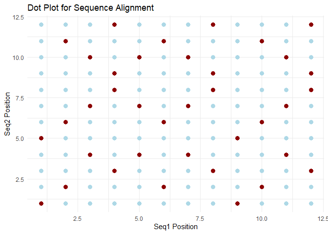

# **Introduction**
*Genomic analysis made elegant using R*

## **Overview**

BioSeqAligner is an R package for biological sequence analysis and alignment.
Whether you're a bioinformatician, researcher, or student, this package
provides intuitive functions for sequence manipulation (motif detection,
reverse complement, DNA-to-RNA transcription, GC content) alongside a full
alignment engine (global and local pairwise alignment, multiple sequence
alignment, alignment metrics, FASTA/FASTQ I/O, batch search, phylogenetics,
and rich visualization) — so the common tasks that would otherwise require
juggling several bioinformatics tools live in one package.

## **Key Features**

-   🔍 Motif Finder: Identify all occurrences of a motif in a DNA sequence.
-   🧬 Reverse Complement: Generate the reverse complement of a sequence.
-   🧪 DNA to RNA Transcription: Convert DNA sequences to RNA by replacing thymine (T) with uracil (U).
-   📊 GC Content Calculator: Calculate the percentage of guanine (G) and cytosine (C) in your DNA sequence using S3 objects.
-   📈 Dot Plot Visualization: Create dot plots to visualize sequence alignments.
-   🧮 Pairwise Alignment: True global (Needleman-Wunsch) and local (Smith-Waterman) alignment with affine gap penalties, for DNA, RNA, and protein.
-   🎯 Scoring Schemes: Built-in nucleotide and BLOSUM62 substitution matrices, or supply your own.
-   🧷 Multiple Sequence Alignment: Progressive MSA with consensus and per-column conservation scoring.
-   📐 Alignment Metrics: Percent identity, similarity, coverage, and gap statistics in one call.
-   🗂️ FASTA / FASTQ I/O: Read and write real sequence files.
-   🚀 Batch (mini-BLAST) Search: Rank one query against many references.
-   🌳 Phylogenetics: Distance matrix and neighbour-joining tree straight from an MSA.
-   🎨 Rich Visualization: Colour-coded pairwise and MSA plots (ggplot2).
-   🖥️ Interactive Shiny App: `launch_aligner()` ties it all together in the browser.
-   🧫 Primer Design + Specificity Screening: `design_and_validate_primers()` runs Primer3 and checks every candidate against your off-target list in one call.
-   🧬 CpG Island Detection + Curated Disease Lookup: `find_cpg_islands()` locates CpG islands from sequence; `cpg_disease_lookup()` checks a small curated table of well-established gene-disease methylation associations.
-   🔬 Bisulfite-Aware Primer Design: `bisulfite_convert()` simulates bisulfite treatment; `design_bisulfite_primers()` designs primers against a converted template for MSP/BSP workflows.

## **Installation**

#### **From GitHub**

You can install this package directly from GitHub.

```r
devtools::install_github("Code-krafter22/BioSeqAligner")
library(BioSeqAligner)
```

## **Packages Required**

```r
install.packages("ggplot2")
install.packages("stringi")
install.packages("stringr")
```

Three features are optional and only need their dependency if you use them:

```r
install.packages("ape")     # for nj_tree()
install.packages("shiny")   # for launch_aligner()
```

```sh
# for design_primers() / design_and_validate_primers() — a system binary,
# not an R package
brew install primer3       # macOS
apt-get install primer3    # Linux
```

## **Load Required Libraries**

```r
library(ggplot2)
library(stringi)
library(stringr)
```

## **Using BioSeqAligner**

### 1. **find_motif()**

Identifies all starting positions of a specified motif within a DNA sequence.
Performs a linear scan and returns the positions where the motif matches the
sequence.

```r
find_motif("GATCGATCGTAT", "GAT")
# Returns [1] 1 5
```

### 2. **generate_dot_plot()**

Creates a dot plot to visualize the alignment between two DNA sequences.
Requires `ggplot2`.

```r
generate_dot_plot("GATCGATCGTAT", "GATATCGTCATC")
# Returns a ggplot dot plot: X-axis is Sequence 1, Y-axis is Sequence 2.
# Dark red dots mark matching positions; blue dots mark mismatches.
```

Overview of how the plot looks:



### 3. **reverse_complement()**

Computes the reverse complement of a given DNA sequence by reversing it and
substituting complementary bases. Requires `stringi`.

```r
reverse_complement("GATCGATCGTAT")
# Returns [1] "ATACGATCGATC"
```

### 4. **transcribe_dna()**

Converts a DNA sequence into an RNA sequence by replacing thymine (T) with
uracil (U). Requires `stringi`.

```r
transcribe_dna("GATCGATCGTAT")
# Returns [1] "GAUCGAUCGUAU"
```

### 5. **gc_content.S3()**

Constructs an S3 object representing a DNA sequence with validation to ensure
it contains only valid DNA bases (A, C, G, T), then calculates the GC content
(percentage of guanine and cytosine). Requires `stringr`.

```r
gc_content.S3(DNASequence("ATGC"))
# Returns [1] 50
```

### 6. **align()**

Performs pairwise sequence alignment via dynamic programming: global
(Needleman-Wunsch) or local (Smith-Waterman), both with affine gap penalties.
Works for DNA, RNA, and protein depending on the scoring matrix supplied.

```r
a <- align("ACGTGGATCGA", "ACGTGCATCGA", method = "global")
print(a)
# Global alignment  |  score = 19  |  identity = 90.9%
#
# seq1   ACGTGGATCGA
#        ||||| |||||
# seq2   ACGTGCATCGA
```

### 7. **scoring_matrix()**

Builds the substitution matrix used to score aligned residues: a nucleotide
match/mismatch scheme, or the BLOSUM62 matrix for proteins.

```r
scoring_matrix("nucleotide", match = 2, mismatch = -1)[c("A","C","G","T"), c("A","C","G","T")]
#    A  C  G  T
# A  2 -1 -1 -1
# C -1  2 -1 -1
# G -1 -1  2 -1
# T -1 -1 -1  2
```

### 8. **alignment_stats()**

Returns a one-row summary of alignment-quality metrics: length, matches,
mismatches, gaps, percent identity, percent gaps, and query coverage.

```r
alignment_stats(a)
#   method score length matches mismatches gaps identity_pct gap_pct query_coverage_pct
# 1 global    19     11      10          1    0        90.91       0                100
```

### 9. **msa_align()**

Aligns three or more sequences using a progressive multiple sequence
alignment strategy, returning an `msa` object with the aligned rows and a
consensus sequence.

```r
seqs <- c(s1 = "ACGTGGAA", s2 = "ACGTGCAA", s3 = "ACGTGGATA")
m <- msa_align(seqs)
print(m)
# Multiple sequence alignment: 3 sequences x 9 columns
#
# s1        ACGTGGA-A
# s2        ACGTGCA-A
# s3        ACGTGGATA
# consensus ACGTGGATA
```

### 10. **conservation_scores()**

Computes, for each column of an `msa` object, the fraction of rows carrying
the most common residue (gaps excluded). A value of 1 means fully conserved.

```r
conservation_scores(m)
# Returns [1] 1.00 1.00 1.00 1.00 1.00 0.67 1.00 1.00 1.00
```

### 11. **batch_align()**

Aligns a single query sequence against a set of reference sequences and
returns a ranked results table — a lightweight, BLAST-like search over a
small, in-memory database.

```r
refs <- c(refA = "TTACGTGGATT", refB = "GGGGCCCC", refC = "AAACGTGGAAA")
batch_align("ACGTGGA", refs, method = "local")
#   reference score identity_pct aln_length ref_start ref_end
# 1      refA    14          100          7         3       9
# 2      refC    14          100          7         3       9
# 3      refB     5           75          4         1       4
```

### 12. **read_fasta()**

Reads a FASTA file into a named character vector of sequences, so you work
from real files instead of pasted strings. `path` must be an existing file —
it is never treated as anything else, so a string that happens to look like
a path can't be confused with literal content.

```r
read_fasta("sequences.fasta")
#      geneA      geneB
# "ACGTGGCA" "TTTTGGCC"
```

### 13. **parse_fasta()**

Parses FASTA-formatted text you already have in memory (e.g. pasted text
from a form) into the same named character vector `read_fasta()` returns.
Unlike `read_fasta()`, it never touches the filesystem — use this, not
`read_fasta()`, whenever the input is already-loaded text rather than a
path you want opened.

```r
parse_fasta(">geneA\nACGT\nGGCA\n>geneB\nTTTT\nGGCC")
#      geneA      geneB
# "ACGTGGCA" "TTTTGGCC"
```

### 14. **write_fasta()**

Writes a named character vector of sequences back out to a FASTA file,
wrapping long sequences at a fixed line width.

```r
write_fasta(c(geneA = "ACGTGGCA", geneB = "TTTTGGCC"), "out.fasta")
# Writes a FASTA file with headers >geneA / >geneB and wrapped sequence lines.
```

### 15. **read_fastq()**

Parses a FASTQ file into a data frame of read IDs, sequences, and quality
strings. `path` must be an existing file, for the same reason as
`read_fasta()`.

```r
read_fastq("reads.fastq")
#    id sequence quality
# 1  r1     ACGT    IIII
```

### 16. **parse_fastq()**

Parses FASTQ-formatted text you already have in memory into the same data
frame `read_fastq()` returns, without touching the filesystem.

```r
parse_fastq("@r1\nACGT\n+\nIIII")
#   id sequence quality
# 1 r1     ACGT    IIII
```

### 17. **nj_tree()**

Computes a distance matrix from an MSA and builds a neighbour-joining
phylogenetic tree, bridging alignment straight into phylogenetics. Requires
`ape`.

```r
nj_tree(m)
# Returns an object of class "phylo" and plots the neighbour-joining tree.
```

### 18. **launch_aligner()**

Launches an interactive Shiny app that ties the package together: paste or
upload sequences, run pairwise or multiple sequence alignment, and view
colour-coded plots, summary metrics, and a neighbour-joining tree in the
browser. Requires `shiny`.

```r
launch_aligner()
# Opens the BioSeqAligner Shiny app in your browser.
```

### 19. **design_primers()**

Runs the real Primer3 engine (`primer3_core`) on a target sequence to design
forward/reverse primer pairs, using Primer3's own thermodynamic model for
melting temperature and secondary-structure checks. Requires a system install
of Primer3 (`brew install primer3` on macOS, `apt-get install primer3` on
Linux).

```r
target <- "ATGGCTAGCATCGATCGTAGCTAGCATCGATCGTAGCTAGCATCGATCGTAGCTAGC..."
design_primers(target, product_size_range = c(70, 120), num_return = 3)
#   pair_id             left_seq            right_seq left_tm right_tm product_size  penalty
# 1       0 TGGCTAGCATCGATCGTAGC TCGATGCTAGCTACGATCGA  59.759   58.208           77 2.033219
# 2       1 TGGCTAGCATCGATCGTAGC TCGATGCTAGCTACGATCGA  59.759   58.208           93 2.033219
# 3       2 TGGCTAGCATCGATCGTAGC TCGATGCTAGCTACGATCGA  59.759   58.208          109 2.033219
```

### 20. **design_and_validate_primers()**

Runs `design_primers()` and immediately screens every candidate primer with
`batch_align()` against a set of sequences you supply (the intended target
plus known paralogs/isoforms/off-targets) — primer design and specificity
checking in a single call. A hit only counts against a primer if it clears
both an identity threshold and a query-coverage threshold, so a short
coincidental match can't masquerade as a real off-target. Requires Primer3.

```r
offs <- c(GENE_A = target, PARALOG_B = near_identical_paralog_seq)
design_and_validate_primers(target, offs,
  intended_target = "GENE_A", product_size_range = c(70, 120), num_return = 2
)
#   pair_id             left_seq            right_seq product_size max_offtarget_identity specific
# 1       0 TGGCTAGCATCGATCGTAGC TCGATGCTAGCTACGATCGA           77                    100    FALSE
# 2       1 TGGCTAGCATCGATCGTAGC TCGATGCTAGCTACGATCGA           93                    100    FALSE
```

### 21. **find_cpg_islands()**

Scans a DNA sequence with a sliding window and flags CpG islands using the
standard sequence-based definition (GC content and observed/expected CpG
ratio above threshold, sustained over a minimum length). This is a purely
structural computation on the sequence you provide — it identifies where a
CpG island exists, but does **not** tell you whether it's actually
methylated in any real sample; methylation is a chemical mark that varies
by tissue/individual/disease and can only be measured from real
bisulfite-sequencing or methylation-array data. Validated against the real
human MLH1 promoter (RefSeq `NC_000003.12:36992465-36993965`), whose CpG
island is well-documented in the cancer epigenetics literature:

```r
promoter <- read_fasta("mlh1_promoter.fasta")
find_cpg_islands(promoter, window = 200, step = 5)
#   start  end length gc_percent obs_exp_ratio
# 1    16 1500   1485   59.75346     0.9081243
```

### 22. **cpg_disease_lookup()**

Looks up a gene symbol in a small, hand-curated (not computed) reference
table of genes whose promoter CpG islands are well-established in the
literature as recurrently hyper/hypomethylated in specific diseases.
Finding no entry does not mean no association exists — only that it isn't
in this small table. Use `find_cpg_islands()` separately to locate islands
from sequence; the two are intentionally kept apart so a structural
sequence fact is never conflated with literature curation.

```r
cpg_disease_lookup("MLH1")
#   gene                                 disease                                               mechanism
# 1 MLH1 Sporadic colorectal cancer (Lynch-like) Promoter hypermethylation silences DNA mismatch repair
```

### 23. **bisulfite_convert()**

Simulates sodium bisulfite treatment of DNA: unmethylated cytosine
converts to thymine, methylated cytosine (protected) stays cytosine. CpG
context is always read from the original sequence, so conversion is a
single deterministic pass. Since non-CpG methylation is negligible in
mammalian DNA, `assume_methylated_cpg = FALSE` (default) converts every
cytosine (a fully unmethylated template); `assume_methylated_cpg = TRUE`
protects only CpG-context cytosines (a fully CpG-methylated template).

```r
bisulfite_convert("ACGTCCGACG")
# [1] "ATGTTTGATG"
bisulfite_convert("ACGTCCGACG", assume_methylated_cpg = TRUE)
# [1] "ACGTTCGACG"
```

### 24. **design_bisulfite_primers()**

Runs `bisulfite_convert()` on a sequence for the chosen reference
methylation state, then `design_primers()` on the converted template —
automating the standard first two steps of methylation-specific PCR (MSP)
or bisulfite sequencing PCR (BSP) primer design. It does not verify that a
returned pair actually discriminates between methylation states; check
that yourself (e.g. against `find_cpg_islands()` output) before ordering.
Requires Primer3.

```r
design_bisulfite_primers(promoter_seq,
  methylation_state = "unmethylated", product_size_range = c(100, 200)
)
```

## **Error Handling**

**Invalid DNA Sequences**: Functions will stop and display an error if the
input contains characters other than A, C, G, or T (unless the function
explicitly supports RNA, protein, or IUPAC ambiguity codes, e.g.
`validate_sequence()`).

```r
transcribe_dna("ATBX")
# Error: Input is not a valid DNA sequence.
```

## **License**

This project is licensed under the MIT License. See the LICENSE file for
details.

## **Contact**

For questions or feedback, reach out via GitHub Issues.

## **Happy sequencing!**
